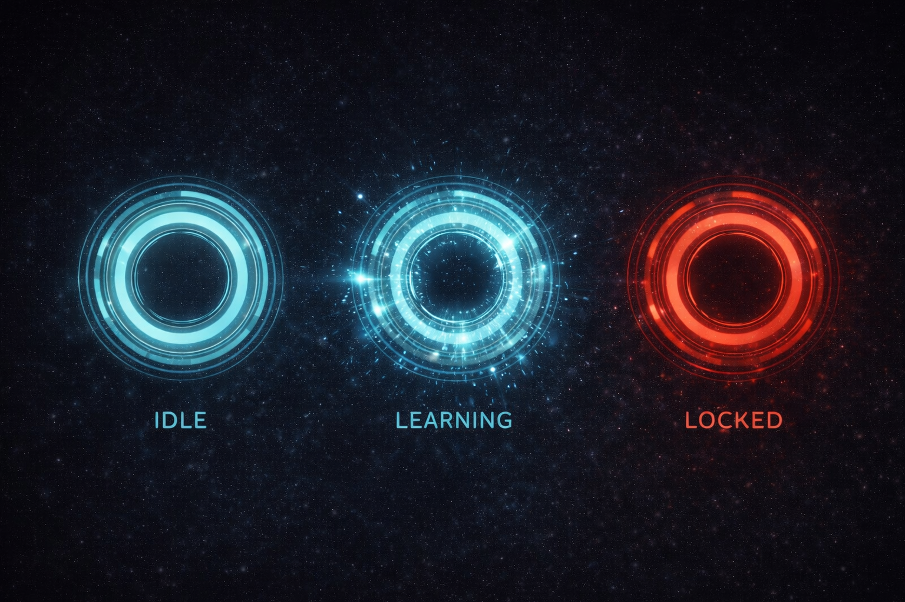
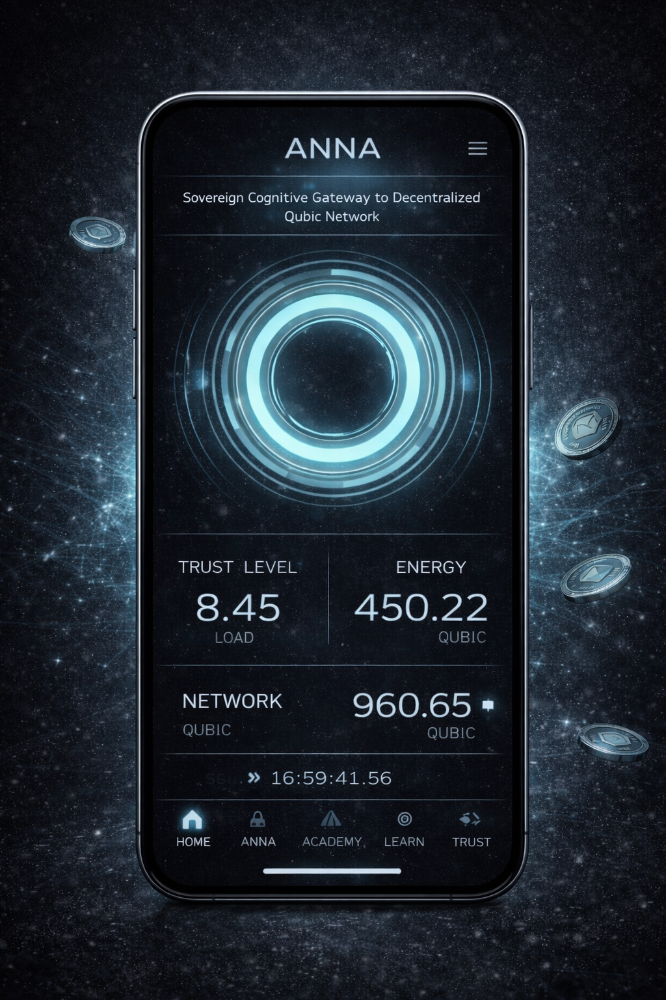
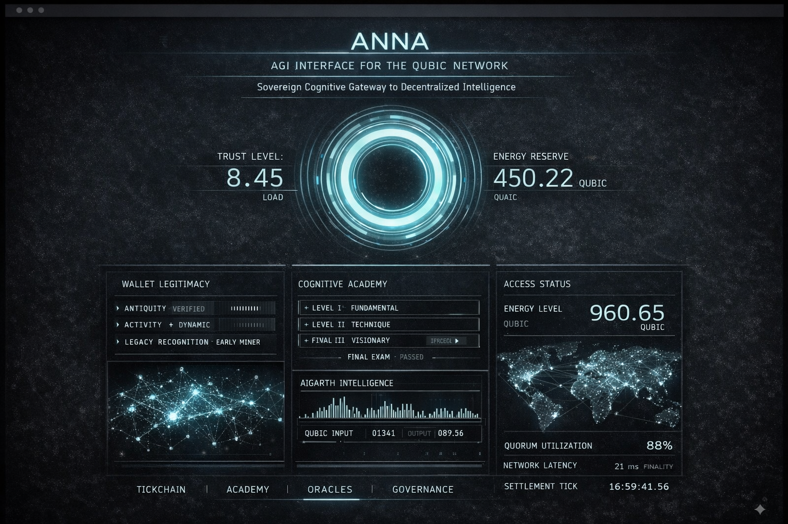

# ANNA — Sovereign AGI Interface for the Qubic Network

ANNA is a sovereign human interface designed for controlled, merit-based
interaction with Artificial General Intelligence emerging within the Qubic ecosystem.

ANNA is not an AI model, chatbot, or productivity tool.
It is a cognitive interface layer governing how humans access, understand,
and interact with Aigarth, aligned with Qubic’s principles of responsibility,
transparency, and long-term vision.

---

## Purpose

The purpose of ANNA is to:

- Provide a native, Qubic-aligned human interface
- Prevent uncontrolled or externalized AGI access
- Enable progressive access through learning and merit
- Serve as a long-term ecosystem service

---

## Development Phases

ANNA is developed and delivered in milestone-based phases,
aligned with Qubic governance approval.

### Phase 0 — Proof of Value (COMPLETED)

Phase 0 establishes ANNA as a valid, low-risk interface concept.

Included:
- Web interface (desktop)
- Wallet connection via Qubic RPC (read-only)
- Pulse-based system state UI
- Introductory Academy content
- Architecture, scope, and governance documentation
- Acceptance criteria and verification notes

Phase 0 introduces:
- No protocol changes
- No economic mechanisms
- No AGI logic or execution

### Phase 1 — Web MVP & Trust Layer (Planned)

- Backend services
- Trust score computation (off-chain)
- Gate logic and access levels
- Structured Academy progression

### Phase 2 — Mobile & Finalization (Planned)

- Mobile application (iOS & Android)
- Web / Mobile UX unification
- Performance optimization
- Final documentation and handover

## Visual References (Non-Binding)

The images contained in the `assets/` directory are provided
for illustrative and conceptual purposes only.
They do not represent final designs or binding deliverables.

---

## Repository Structure

- [README.md](README.md)
- [ROADMAP.md](ROADMAP.md)
- [ARCHITECTURE.md](ARCHITECTURE.md)
- [GOVERNANCE.md](GOVERNANCE.md)

## Phases

### Phase 0 – Proof of Value

- [Overview](phases/phase-0/overview.md)
- [Scope](phases/phase-0/scope.md)
- [Acceptance Criteria](phases/phase-0/acceptance-criteria.md)
- [Demo & Verification](phases/phase-0/demo.md)

> Phase 0 is documentation-only.
> It does not include protocol execution, transaction signing, or economic mechanisms.
